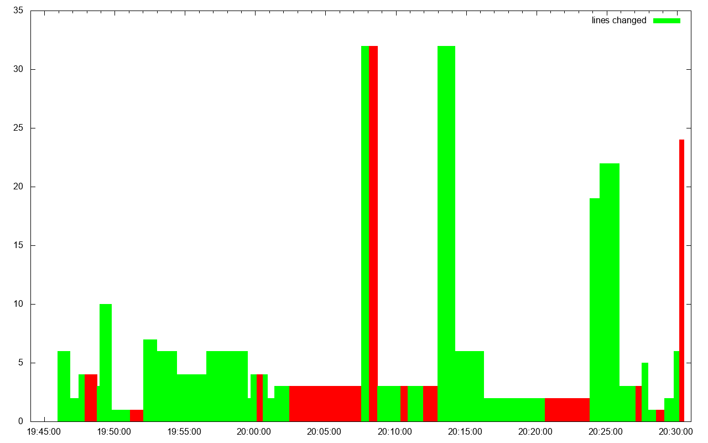

# Test-Commit-Revert Greed Kata

This repository contains the result of a [Greed Kata](http://codingdojo.org/kata/Greed/) that was run on March 17th as part of the [Software Crafters Nantes](https://www.meetup.com/nantes-software-crafters-Nantes/events/269399967) meetup. The code is in Haskell and we ran the Kata following the [Test-Commit-Revert](https://medium.com/@kentbeck_7670/test-commit-revert-870bbd756864) (shortened to TCR) programming workflow advocated by Kent Beck.

* [tcr](tcr) is a python script implementing the TCR flow. It uses either [fswatch](https://github.com/emcrisostomo/fswatch) or [inotify](http://man7.org/linux/man-pages/man7/inotify.7.html) to monitor the current directory (minus a few exclusions) and rerun the tests on each change
* [test/GreedSpec.hs](test/GreedSpec.hs) contains all the code we wrote as we kept both "production" code and tests in the same file

# Analyzing Activity

git's `commit` and `reset` commands generate an entry in the _references log_ within the Git repository which can be seen with `git reflog` command. We can generate [stats](stats) file using the following command:

```
$ g reflog --date=iso8601 --shortstat --oneline
```

plus some semi-manual editing in a text editor, to get a file that looks like this:

```
19:46:21,commit,5,1
19:47:13,commit,1,1
19:47:40,commit,2,2
19:48:02,reset,2,2
...
```

Each line gives a timestamp, the change at that time either a _commit_ or a _reset_ and the number of lines added and deleted.

With the help of a small [gnuplot](http://www.gnuplot.info/) [script](activity.plot) we can generate the following graph



Red and green boxes respectively represent `reset` and `commit` "periods" with the height of the box representing the sum of lines changed at each step.

It's unclear how to interpret this data as it is probably too narrow in range to provide some generally useful insights into TCR practice, yet it's interesting to see that:

* Most of the "steps" involve small changes of 3-5 lines which is probably a good thing. The few "spikes" in the stream of changes represent refactoring like code reformatting or renaming of functions,
* Steps are very small, less than one minute in length (width of the boxes) which is also probably a good thing and an intended consequence of TCR,
* There is a "long" streak of reverts around 20:05 representing a period of doubt in the kata when we were unsure about where to go next.
